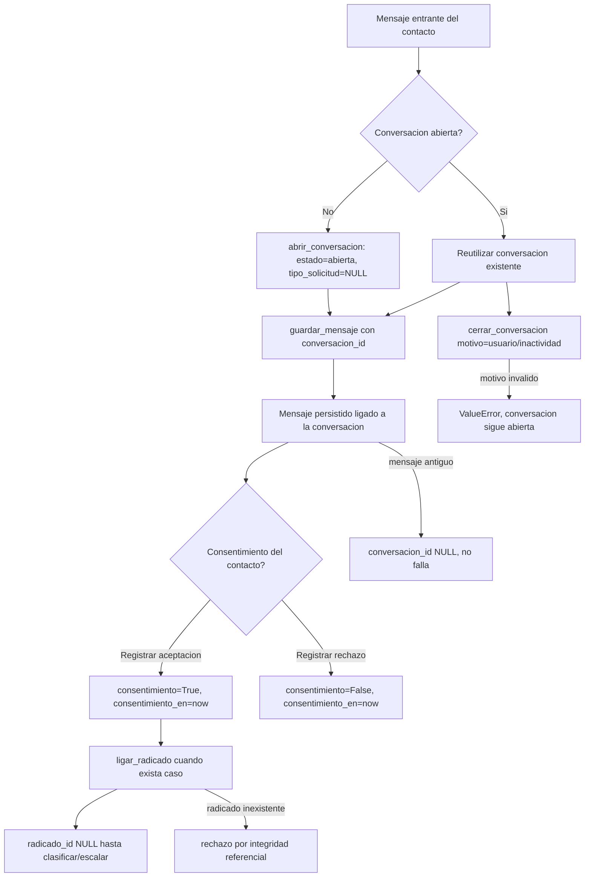

# Flow EP-006 — Modelo Conversación + Consentimiento

Flujo de datos al llegar un mensaje entrante y persistir conversación, mensaje, consentimiento y
enlace a radicado.

## Cobertura

- **Camino feliz:** apertura de conversación → mensaje ligado → consentimiento → enlace a radicado.
- **Ramal de error:** motivo de cierre inválido (HU-034 AC-4); radicado inexistente (HU-037 AC-3).
- **Edge:** mensaje antiguo sin `conversacion_id` (HU-035 AC-3).
