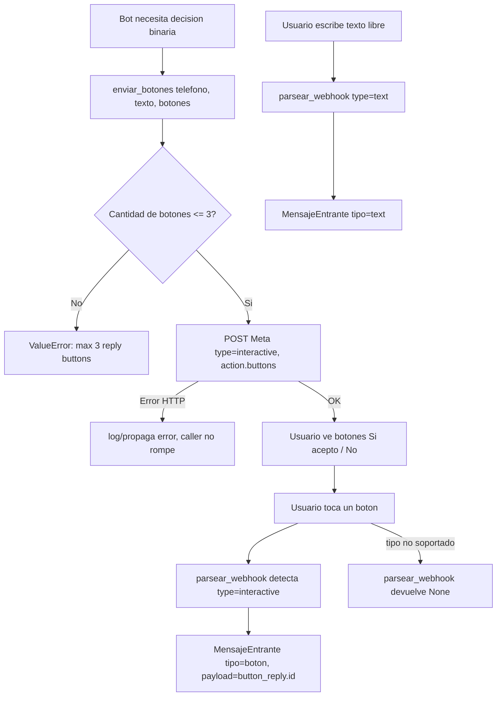

# Flow EP-007 — Botones interactivos WhatsApp

## Cobertura

- **Camino feliz:** enviar botones válidos → usuario toca → parseo devuelve `payload`.
- **Ramal de error:** >3 botones (HU-038 AC-3); error HTTP del provider (HU-038 AC-4).
- **Edge:** tipo de mensaje no soportado devuelve None (HU-039 AC-3).
