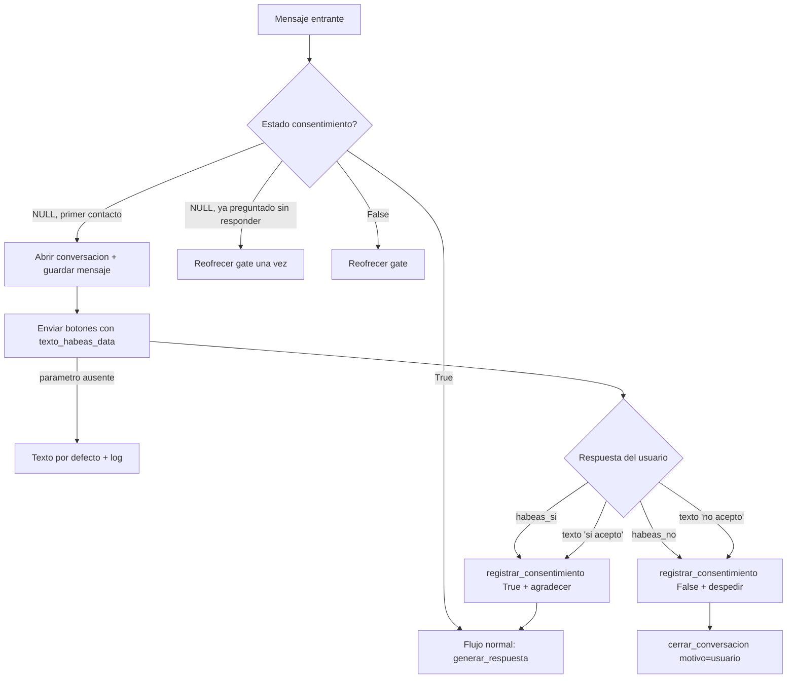

# Flow EP-008 — Gate de consentimiento habeas data

## Cobertura

- **Camino feliz:** contacto nuevo → gate → acepta → flujo normal.
- **Ramal de error:** parámetro `texto_habeas_data` ausente → texto por defecto (HU-040 AC-4).
- **Edge:** aceptación/rechazo por texto libre (HU-041 AC-3, HU-042 AC-3); re-solicitud si pendiente.
