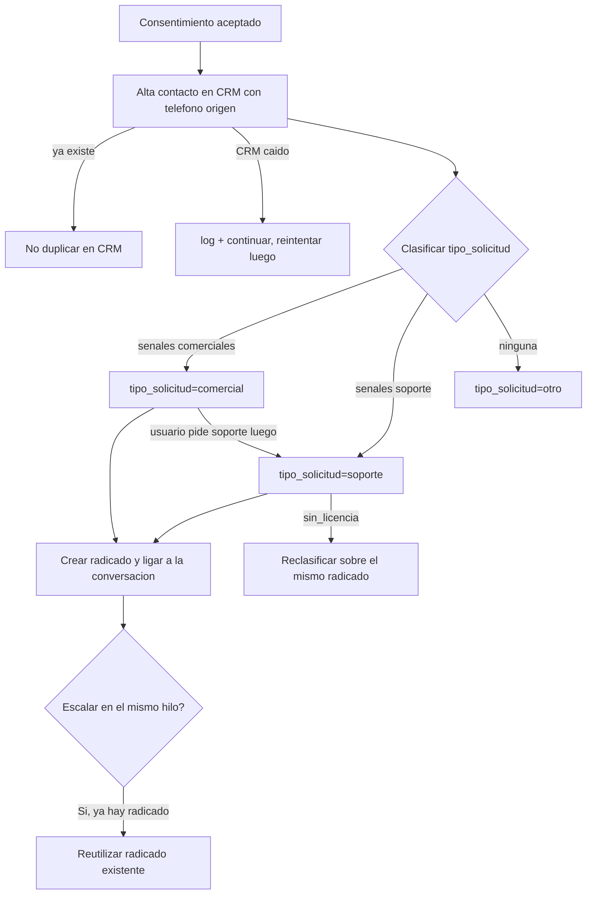

# Flow EP-009 — Clasificación de flujo + alta CRM

## Cobertura

- **Camino feliz:** aceptar → alta CRM → clasificar → radicado ligado.
- **Ramal de error:** CRM caído → continuar con degradación (HU-044 AC-3).
- **Edge:** reclasificación de tema (HU-043 AC-4); reclasificar sin licencia sobre el mismo radicado
  (HU-045 AC-3).
