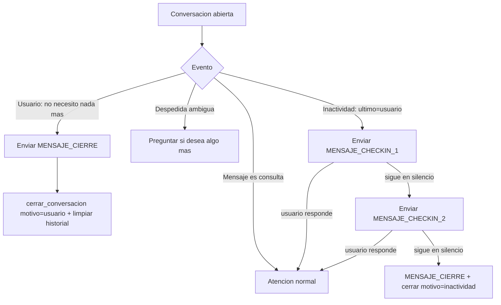

# Flow EP-010 — Cierre explícito de conversación

## Cobertura

- **Camino feliz:** cierre por indicación del usuario con despedida (HU-046 AC-1).
- **Ramal de error/alternativo:** no cerrar en medio de una consulta (HU-046 AC-2); despedida ambigua
  pregunta antes de cerrar (HU-046 AC-3).
- **Edge:** usuario responde entre check-ins → reinicia ciclo (HU-047 AC-4).
