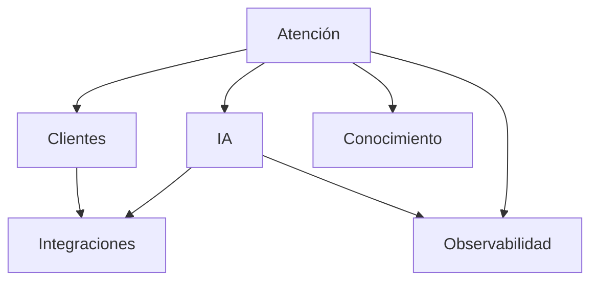
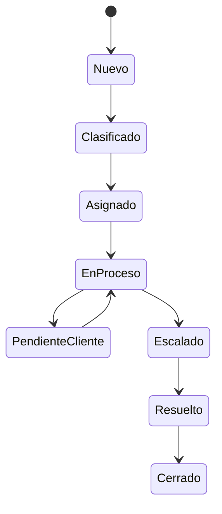

# Capítulo 3 — Modelo de Dominio

**Construye sobre:** fase 2-mvp / 01-Analisis_Modelo

## Introducción

Una plataforma empresarial debe diseñarse desde el **dominio del negocio**, no desde la base de datos.

## Filosofía

El concepto principal es el **Radicado (Caso)**.

```text
Cliente
   │
Radicado
   │
Conversación
   │
Mensaje
```

## Principios

- Independencia tecnológica
- Arquitectura Hexagonal
- Event Driven
- Multi-tenant
- Agentes especializados

## Bounded Contexts

| Dominio | Responsabilidad |
|---------|-----------------|
| Atención | Gestionar radicados y conversaciones |
| Clientes | Gestionar clientes y contactos |
| IA | Orquestar agentes |
| Conocimiento | Administrar RAG |
| Integraciones | CRM, ERP, Help Desk |
| Observabilidad | Logs, auditoría y métricas |



## Agregado Raíz

El agregado raíz es el **Radicado**.

### Entidades

- Radicado
- Conversación
- Mensaje
- Evento
- Asignación
- SLA

### Objetos de Valor

- Estado
- Prioridad
- Canal
- Tipo de Solicitud
- Categoría

## Reglas de Negocio

1. Todo mensaje pertenece a una conversación.
2. Toda conversación pertenece a un radicado.
3. Todo radicado pertenece a un cliente.
4. Toda ejecución del agente genera auditoría.
5. Toda herramienta utilizada genera un Tool Call.

## Estados del Radicado



## ADR

### ADR-001

**Decisión:** El Radicado será el agregado raíz.

**Razón:** Centraliza la trazabilidad y desacopla los canales.

### ADR-002

**Decisión:** Los agentes nunca consumen directamente sistemas externos.

**Razón:** Toda integración se realiza mediante herramientas (Tools).

## Próximo capítulo

Arquitectura General de la Plataforma (C4 + Microservicios + Agent Core + MCP + LangGraph).
