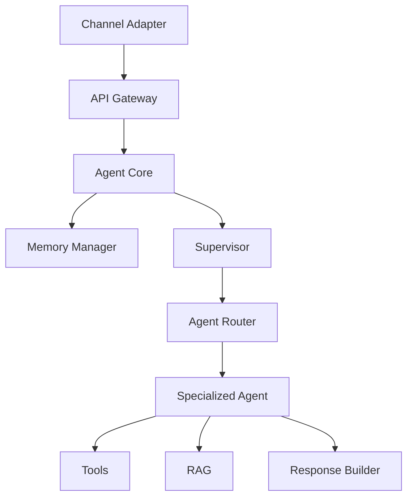
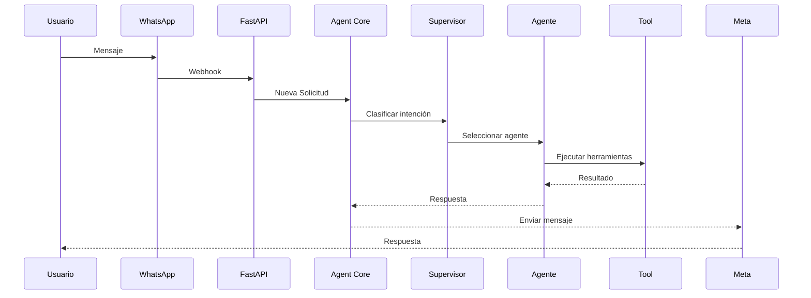
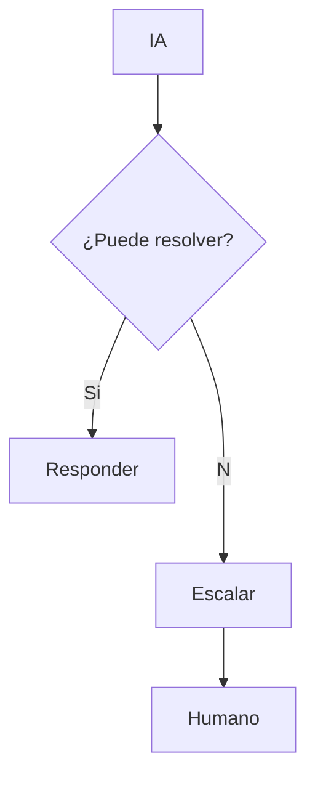

# Capítulo 5 — Agent Core

**Construye sobre:** fase 2-mvp / 02-Modelo_Dominio

## Objetivo

Definir la arquitectura interna del **Agent Core**, el componente responsable de coordinar toda la inteligencia de la plataforma.

---

# Responsabilidades

- Recibir solicitudes desde cualquier canal.
- Recuperar el contexto del radicado.
- Clasificar la intención.
- Seleccionar el agente especializado.
- Ejecutar herramientas.
- Consultar RAG.
- Registrar auditoría.
- Publicar eventos.
- Construir la respuesta.

---

# Arquitectura

---

# Flujo General

---

# Componentes

## Memory Manager

Gestiona:

- Memoria de sesión
- Historial del radicado
- Resúmenes
- Contexto del cliente

## Supervisor

Funciones:

- Clasificación
- Detección de idioma
- Detección de área
- Escalamiento
- Selección del agente

## Agent Router

Selecciona dinámicamente el agente más adecuado.

Ejemplo:

| Intención | Agente |
|-----------|--------|
| Comprar | Comercial |
| Error | Soporte |
| Factura | Facturación |

---

# Contexto

El contexto enviado al LLM estará compuesto por:

1. Datos del cliente.
2. Resumen del radicado.
3. Últimos mensajes.
4. Información recuperada del RAG.
5. Resultados de herramientas.
6. Prompt del agente.

---

# Ciclo de Ejecución

1. Recibir mensaje.
2. Crear/recuperar radicado.
3. Recuperar memoria.
4. Clasificar intención.
5. Seleccionar agente.
6. Ejecutar herramientas.
7. Consultar RAG.
8. Generar respuesta.
9. Registrar auditoría.
10. Responder al canal.

---

# Tool Calling

Todas las acciones externas se realizan mediante Tools.

Ejemplos:

- Buscar Cliente
- Crear Ticket
- Consultar Factura
- Consultar Licencia
- Enviar Correo

---

# Gestión de Memoria

## Corto plazo

Conversación activa.

## Mediano plazo

Resumen del radicado.

## Largo plazo

Histórico del cliente.

---

# Escalamiento

---

# Observabilidad

Registrar:

- Modelo
- Tokens
- Costo
- Latencia
- Tool Calls
- Errores
- Tiempo de respuesta
- SLA

---

# ADR

## ADR-009

El Agent Core será el único punto de entrada a la inteligencia.

## ADR-010

El Supervisor nunca responderá directamente al usuario.

## ADR-011

Los agentes solo interactúan mediante herramientas y RAG.

---

# Próximo Capítulo

**Capítulo 6 — Arquitectura Multiagente**, donde se definirá el Supervisor, los agentes especializados, patrones de colaboración, LangGraph y coordinación entre agentes.
