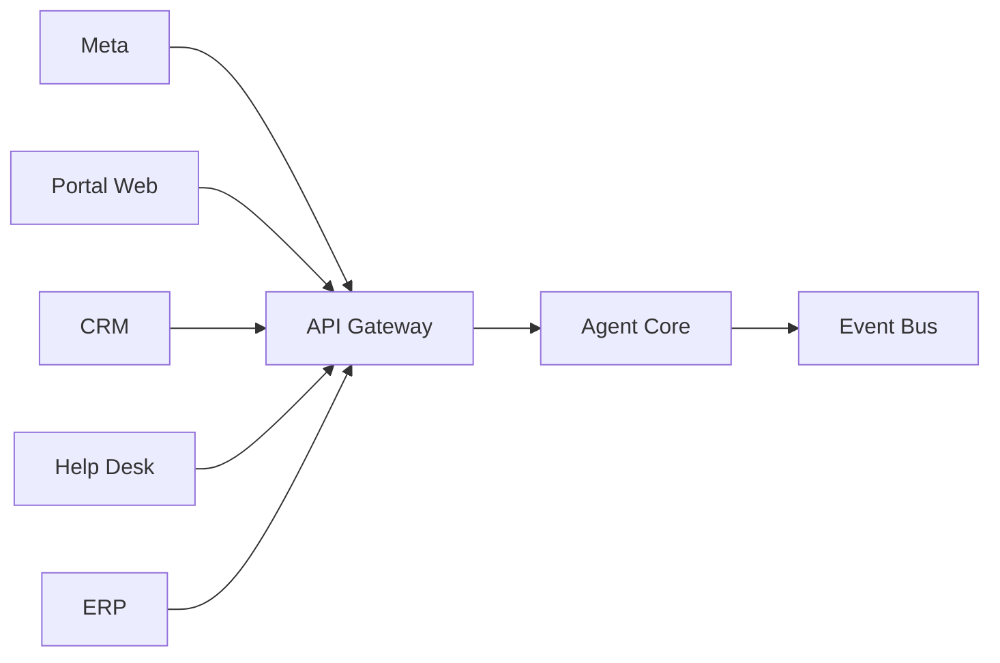

# Capítulo 9 — Contratos de Integración y Especificación de APIs

**Construye sobre:** fase 2-mvp / 03-Agent_Core

**Versión:** 1.0

**Estado:** Borrador

---

# 1. Objetivo

Este documento define todos los contratos de comunicación entre los componentes de la plataforma.

La plataforma será **API First**, lo que significa que toda funcionalidad deberá estar disponible mediante interfaces bien definidas y desacopladas de la implementación.

Los contratos aquí descritos serán la base para la implementación en FastAPI, así como para las integraciones con canales de comunicación, sistemas corporativos y herramientas utilizadas por los agentes de IA.

---

# 2. Principios

Todos los contratos deberán cumplir los siguientes principios:

- Stateless.
- Versionados.
- Idempotentes cuando sea posible.
- Orientados al dominio.
- Independientes del proveedor.
- Documentados mediante OpenAPI.

---

# 3. Tipos de Interfaces

La plataforma utilizará diferentes mecanismos de comunicación dependiendo del caso de uso.

| Tipo | Uso |
|------|-----|
| REST | Operaciones síncronas |
| Webhooks | Eventos externos |
| MCP | Herramientas para agentes |
| Event Bus | Comunicación asíncrona |
| WebSocket | Actualizaciones en tiempo real (Futuro) |

---

# 4. Arquitectura de Integración



---

# 5. API Gateway

Toda solicitud ingresará por un único punto de entrada.

Responsabilidades:

- Autenticación.
- Validación.
- Rate limiting.
- Versionado.
- Auditoría.
- Logging.
- Routing.

Nunca contendrá lógica de negocio.

---

# 6. Versionado

Todas las APIs utilizarán versionado mediante URL.

Ejemplo

```
/api/v1/
```

En futuras versiones.

```
/api/v2/
```

Nunca se romperá compatibilidad.

---

# 7. Convenciones REST

Los recursos utilizarán sustantivos.

Correcto

```
GET /clientes
```

Incorrecto

```
GET /obtenerClientes
```

---

# 8. Recursos Principales

La plataforma expondrá los siguientes dominios.

```
/clientes

/contactos

/radicados

/conversaciones

/mensajes

/agentes

/areas

/eventos

/tool-calls

/executions

/documentos

/colecciones

/integraciones

/configuracion

/slas
```

---

# 9. API de Clientes

## Crear Cliente

```
POST /api/v1/clientes
```

Body

```json
{
  "nombre": "Empresa ABC",
  "tipo": "EMPRESA",
  "correo": "contacto@empresa.com"
}
```

Respuesta

```json
{
  "id":"UUID",
  "estado":"CREADO"
}
```

---

## Consultar Cliente

```
GET /api/v1/clientes/{id}
```

---

## Buscar Cliente

```
GET /api/v1/clientes?nombre=abc
```

---

# 10. API de Radicados

## Crear

```
POST /api/v1/radicados
```

Body

```json
{
  "cliente_id":"UUID",
  "canal":"WHATSAPP",
  "motivo":"Consulta comercial"
}
```

Respuesta

```json
{
  "radicado":"RAD-2026-000001",
  "estado":"NUEVO"
}
```

---

## Consultar

```
GET /api/v1/radicados/{id}
```

---

## Cambiar Estado

```
PATCH /api/v1/radicados/{id}
```

---

## Escalar

```
POST /api/v1/radicados/{id}/escalar
```

---

## Cerrar

```
POST /api/v1/radicados/{id}/cerrar
```

---

# 11. API de Conversaciones

```
POST /api/v1/conversaciones

GET /api/v1/conversaciones/{id}

GET /api/v1/radicados/{id}/conversaciones
```

---

# 12. API de Mensajes

```
POST /api/v1/mensajes

GET /api/v1/conversaciones/{id}/mensajes
```

---

# 13. API de Agentes

Consultar agentes disponibles.

```
GET /api/v1/agentes
```

Consultar capacidades.

```
GET /api/v1/agentes/{id}
```

---

# 14. API de Documentación

Consultar colecciones.

```
GET /api/v1/knowledge/collections
```

Subir documento.

```
POST /api/v1/knowledge/documents
```

Reindexar.

```
POST /api/v1/knowledge/reindex
```

---

# 15. Webhooks

La plataforma expondrá endpoints para recibir eventos externos.

## Meta

```
POST /webhooks/meta
```

## CRM

```
POST /webhooks/crm
```

## Help Desk

```
POST /webhooks/helpdesk
```

Todos los webhooks deberán validar firma y registrar auditoría.

---

# 16. MCP (Model Context Protocol)

Las herramientas utilizadas por los agentes serán expuestas mediante MCP.

Ejemplos:

- consultar_cliente
- crear_ticket
- consultar_factura
- consultar_licencia
- buscar_documentacion
- enviar_correo

El Agent Core nunca conocerá la implementación de estas herramientas.

---

# 17. Eventos Publicados

El sistema publicará eventos de dominio como:

- RadicadoCreado
- RadicadoAsignado
- MensajeRecibido
- MensajeRespondido
- ToolEjecutada
- AgenteEjecutado
- DocumentoIndexado
- ClienteActualizado

Estos eventos podrán ser consumidos por procesos asíncronos sin acoplar los servicios.

---

# 18. Autenticación

Se proponen tres mecanismos de autenticación según el consumidor:

| Consumidor | Método |
|------------|--------|
| Frontend | JWT |
| Integraciones internas | API Key |
| Servicios internos | OAuth2 Client Credentials |

Cada petición deberá incluir un identificador de tenant para garantizar el aislamiento de datos.

---

# 19. Manejo de Errores

Todas las APIs responderán con un formato uniforme.

```json
{
  "error": {
    "code": "RADICADO_NOT_FOUND",
    "message": "El radicado solicitado no existe.",
    "trace_id": "7baf8f3d..."
  }
}
```

Esto facilitará la observabilidad y la correlación de errores entre servicios.

---

# 20. ADR

## ADR-021

Toda funcionalidad del dominio deberá exponerse mediante contratos bien definidos.

## ADR-022

Las integraciones externas nunca accederán directamente a la base de datos.

## ADR-023

El Agent Core solo consumirá interfaces públicas y herramientas MCP; nunca dependerá de implementaciones concretas.

---

# Próximo Capítulo

## Capítulo 10 — Arquitectura de Integraciones

Se describirá el diseño de los adaptadores para Meta, CRM, ERP, plataformas de soporte, correo electrónico, calendarios y otros sistemas externos, incluyendo estrategias de resiliencia, reintentos, circuit breakers y sincronización de datos.