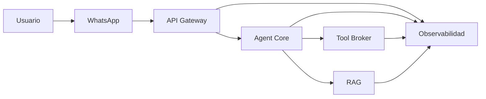

# Capítulo 12 — Observabilidad, Auditoría y Telemetría

**Construye sobre:** fase 2-mvp / 04-Contratos_Integracion

**Versión:** 1.0

**Estado:** Draft

---

# 1. Objetivo

Definir la estrategia integral de observabilidad de la plataforma para garantizar trazabilidad, monitoreo, auditoría, optimización de costos y diagnóstico de problemas en tiempo real.

La observabilidad deberá cubrir tanto los componentes tradicionales como las ejecuciones de agentes de IA.

---

# 2. Principios

- Observabilidad desde el diseño (Observability by Design)
- Trazabilidad End-to-End
- Auditoría completa
- Métricas en tiempo real
- Logs estructurados
- Correlación entre servicios
- Monitoreo de costos de IA

---

# 3. Arquitectura



---

# 4. Componentes

| Componente | Responsabilidad |
|------------|-----------------|
| Logging Service | Centralización de logs |
| Metrics Service | Recolección de métricas |
| Trace Service | Trazabilidad distribuida |
| Audit Service | Auditoría funcional |
| Cost Service | Costos de IA |
| Alert Manager | Gestión de alertas |

---

# 5. Logging

Todos los servicios deberán generar logs estructurados en formato JSON.

Ejemplo:

```json
{
  "timestamp":"2026-07-10T12:00:00Z",
  "service":"agent-core",
  "tenant":"empresa-1",
  "radicado":"RAD-2026-001",
  "level":"INFO",
  "message":"Tool ejecutada correctamente",
  "trace_id":"abc123"
}
```

---

# 6. Trazabilidad Distribuida

Cada solicitud tendrá:

- Trace ID
- Span ID
- Parent Span ID

El Trace ID acompañará toda la ejecución:

```text
WhatsApp
   │
API Gateway
   │
Agent Core
   │
Tool Broker
   │
CRM
```

---

# 7. Métricas

Registrar al menos:

- Solicitudes por minuto
- Tiempo de respuesta
- Latencia por Tool
- Errores por servicio
- Uso de CPU
- Uso de memoria
- Cantidad de radicados
- Conversaciones activas

---

# 8. Métricas de IA

Registrar:

- Modelo utilizado
- Tokens de entrada
- Tokens de salida
- Tiempo de inferencia
- Costo estimado
- Herramientas ejecutadas
- Cantidad de llamadas al RAG

---

# 9. Auditoría

Auditar:

- Cambios de estado del radicado
- Cambio de agente
- Escalamientos
- Herramientas ejecutadas
- Accesos administrativos
- Cambios de configuración

La auditoría será inmutable.

---

# 10. KPIs

## Operativos

- Tiempo promedio de respuesta
- Tiempo promedio de resolución
- SLA cumplidos
- SLA incumplidos

## IA

- Precisión del RAG
- Handoff a humano
- Tasa de resolución automática
- Consumo de tokens por conversación

---

# 11. Alertas

Alertar cuando:

- Latencia > 5 s
- Error Rate > 5 %
- Tool indisponible
- RAG no disponible
- Consumo de tokens anómalo
- Incremento inesperado del costo

---

# 12. Dashboards

Se recomienda disponer de paneles para:

- Operación general
- IA
- Costos
- Integraciones
- SLA
- Radicados

---

# 13. Retención

| Tipo | Retención |
|------|-----------|
| Logs | 90 días |
| Auditoría | 5 años |
| Métricas | 1 año |
| Trazas | 30 días |

---

# 14. Seguridad

- Anonimizar información sensible
- Control de acceso a métricas
- Cifrado de auditorías
- Integridad de registros

---

# 15. Herramientas Sugeridas

| Función | Herramienta |
|---------|-------------|
| Logs | Loki / ELK |
| Métricas | Prometheus |
| Dashboards | Grafana |
| Trazas | OpenTelemetry + Jaeger |
| Alertas | Alertmanager |

---

# 16. ADR

## ADR-031

Toda solicitud deberá generar un Trace ID único.

## ADR-032

Los costos de IA serán registrados por ejecución.

## ADR-033

La auditoría será inmutable y separada de los logs operativos.

## ADR-034

La observabilidad no dependerá de un proveedor específico.

---

# 17. Roadmap

## MVP

- Logs estructurados
- Métricas básicas
- Auditoría
- Dashboard principal

## Fase 2

- OpenTelemetry
- Trazabilidad distribuida
- KPIs de IA
- Alertas automáticas

## Fase 3

- Predicción de fallos
- Análisis de costos
- Observabilidad basada en IA

---

# Próximo Capítulo

**Capítulo 13 — Seguridad, Autenticación y Gobierno**, donde se definirá el modelo de autenticación, autorización, gestión de secretos, RBAC, cumplimiento normativo y políticas de seguridad de la plataforma.
