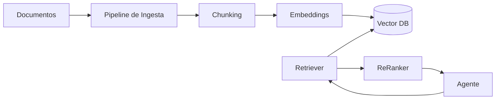

# Capítulo 7 — Arquitectura RAG y Gestión del Conocimiento

**Construye sobre:** fase 2-mvp (modelo de datos de radicados)

## Objetivo

Diseñar una arquitectura de Retrieval-Augmented Generation (RAG) que permita a los agentes responder con información precisa, trazable y actualizada, desacoplando el conocimiento del modelo de lenguaje.

---

# Objetivos

- Centralizar el conocimiento empresarial.
- Evitar alucinaciones.
- Permitir versionado de documentos.
- Soportar múltiples empresas (multi-tenant).
- Facilitar auditoría de respuestas.

---

# Arquitectura General



---

# Fuentes de Conocimiento

| Tipo | Ejemplos |
|------|----------|
| PDF | Manuales |
| Word | Procedimientos |
| Excel | Tarifas |
| HTML | Base de conocimiento |
| API | CRM / ERP |
| Wiki | Documentación interna |

---

# Pipeline de Ingesta

1. Cargar documento.
2. Extraer texto.
3. Normalizar.
4. Detectar idioma.
5. Generar metadata.
6. Dividir en chunks.
7. Generar embeddings.
8. Almacenar.

---

# Estrategia de Chunking

## Reglas

- Mantener contexto semántico.
- Evitar cortar tablas.
- Conservar títulos.

Tamaño recomendado:

- 400–800 tokens
- Overlap: 15–20%

---

# Metadata

Cada chunk incluirá:

```json
{
 "empresa":"tenant",
 "coleccion":"soporte",
 "documento":"manual.pdf",
 "version":"1.2",
 "pagina":15,
 "titulo":"Instalación"
}
```

---

# Colecciones

Cada dominio tendrá su colección.

- Comercial
- Soporte
- Facturación
- Implementación
- Legal

Nunca mezclar información crítica entre áreas.

---

# Recuperación

1. Embedding de la consulta.
2. Búsqueda vectorial.
3. Filtro por tenant.
4. Filtro por colección.
5. Re-ranking.
6. Contexto al LLM.

---

# Versionado

Cada documento tendrá:

- Versión
- Fecha
- Autor
- Estado (Activo/Obsoleto)

Nunca se eliminarán versiones históricas.

---

# Actualización

Eventos:

- Documento agregado
- Documento actualizado
- Documento archivado

Las reindexaciones serán incrementales.

---

# Seguridad

- Aislamiento por tenant.
- ACL por colección.
- Cifrado en tránsito.
- Cifrado en reposo.

---

# Observabilidad

Registrar:

- Documento utilizado.
- Chunk utilizado.
- Score de recuperación.
- Tiempo de búsqueda.
- Tokens añadidos.
- Coste.

---

# ADR

## ADR-015

Cada área tendrá una colección independiente.

## ADR-016

El RAG siempre citará la fuente utilizada.

## ADR-017

El pipeline de ingesta será desacoplado del Agent Core.

---

# Próximo Capítulo

**Capítulo 8 — Modelo de Datos Empresarial**, donde se definirá el esquema PostgreSQL completo, agregados, índices, particionamiento, auditoría y estrategia multi-tenant.
