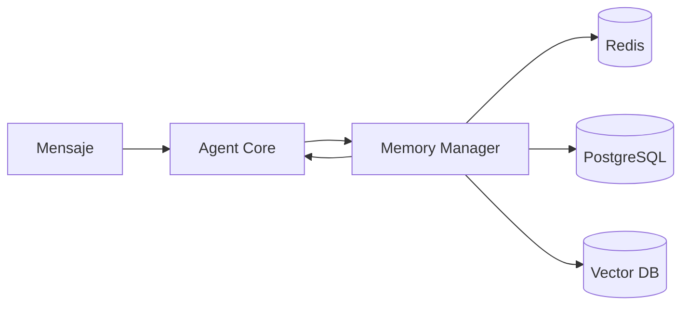
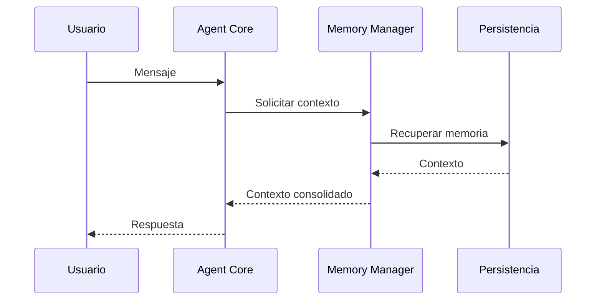

# Capítulo 11 — Arquitectura de Memoria y Gestión del Contexto

**Construye sobre:** fase 3-rag / 01-Arquitectura_RAG

**Versión:** 1.0

## Objetivo

Definir cómo la plataforma almacena, resume y recupera el contexto necesario para que los agentes mantengan conversaciones coherentes, reduzcan el consumo de tokens y conserven la trazabilidad de cada radicado.

---

# Principios

- La memoria pertenece al **radicado**, no al canal.
- El LLM nunca es la fuente de verdad.
- Todo contexto es recuperable y auditable.
- El contexto se resume progresivamente.
- La memoria está aislada por tenant.

---

# Tipos de Memoria

| Tipo | Persistencia | Uso |
|------|--------------|-----|
| Corto Plazo | Redis | Conversación activa |
| Mediano Plazo | PostgreSQL | Resumen del radicado |
| Largo Plazo | PostgreSQL + Vector DB | Historial del cliente |
| Conocimiento | Vector DB | RAG |

---

# Arquitectura

---

# Flujo de Recuperación

---

# Memoria de Corto Plazo

Contiene:

- Últimos mensajes
- Estado de la conversación
- Variables temporales
- Herramientas ejecutadas

TTL recomendado: 30 minutos tras la última interacción.

---

# Memoria de Mediano Plazo

Persistida en PostgreSQL.

Incluye:

- Resumen ejecutivo del radicado
- Estado actual
- Decisiones tomadas
- Compromisos
- Próximos pasos

---

# Memoria de Largo Plazo

Asociada al cliente.

Ejemplos:

- Historial de incidencias
- Preferencias
- Licencias adquiridas
- Implementaciones previas

---

# Resumen Automático

Cuando el contexto supera el límite configurado:

1. Generar resumen.
2. Persistir resumen.
3. Reemplazar mensajes antiguos por el resumen.
4. Mantener auditoría completa.

---

# Construcción del Contexto

El contexto enviado al modelo contendrá:

1. Prompt del sistema.
2. Perfil del agente.
3. Datos del cliente.
4. Resumen del radicado.
5. Últimos mensajes.
6. Resultados de herramientas.
7. Fragmentos RAG.

---

# Gestión de Tokens

Prioridad:

1. Resumen
2. Últimos mensajes
3. Tool Calls
4. RAG
5. Historial completo (solo si es necesario)

---

# Continuidad

Un cambio de canal (WhatsApp → Web) no crea un nuevo radicado.

La conversación continúa utilizando el mismo contexto.

---

# Auditoría

Registrar:

- Contexto utilizado
- Resumen generado
- Tokens enviados
- Tokens descartados
- Modelo utilizado

---

# Seguridad

- Aislamiento por tenant
- Cifrado de información sensible
- Eliminación según políticas de retención
- Control de acceso por roles

---

# ADR

## ADR-028

La memoria será administrada exclusivamente por el Memory Manager.

## ADR-029

Los resúmenes reemplazarán contexto histórico para optimizar costos.

## ADR-030

El contexto se construirá dinámicamente en cada solicitud.

---

# Próximo Capítulo

**Capítulo 12 — Observabilidad, Auditoría y Telemetría**, donde se definirá el monitoreo integral de agentes, herramientas, costos, métricas, logs distribuidos y trazabilidad end-to-end.
