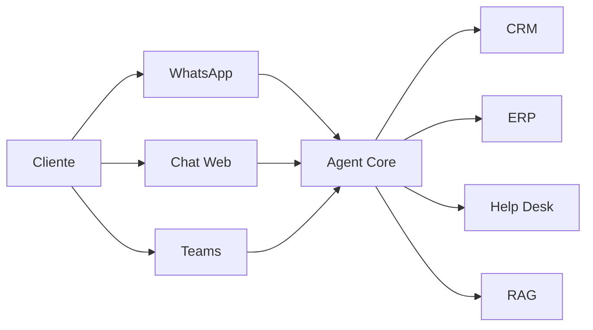
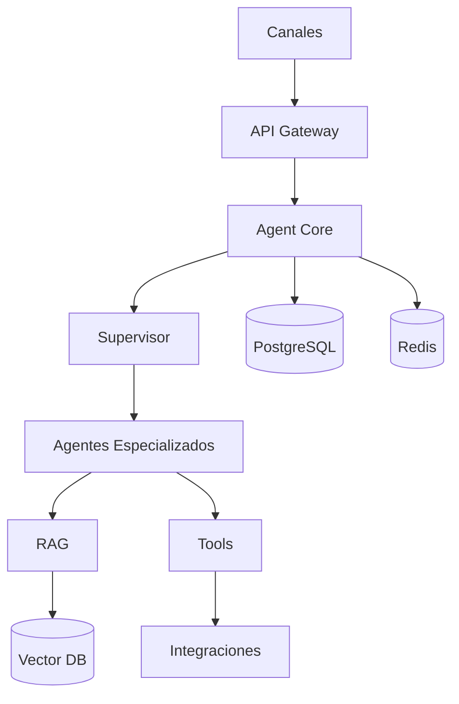
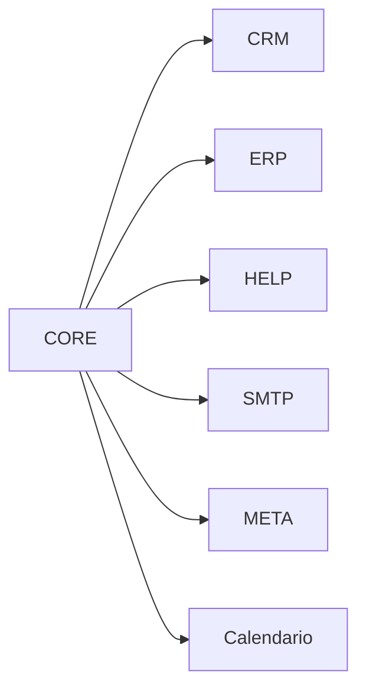
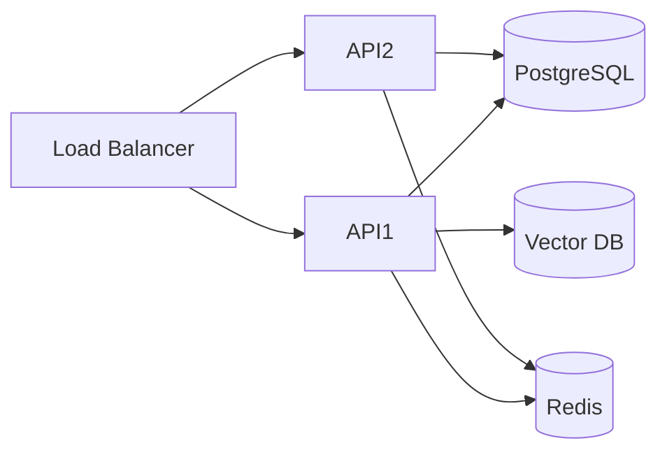

# Capítulo 4 — Arquitectura General de la Plataforma

**Construye sobre:** fase 3-rag (Agent Core + RAG)

**Versión:** 1.0

## Objetivo

Definir la arquitectura lógica y física de la plataforma de atención omnicanal basada en agentes de IA, garantizando desacoplamiento, escalabilidad y mantenibilidad.

---

# Principios

- Arquitectura Hexagonal
- Domain Driven Design (DDD)
- Event Driven
- API First
- Multi-tenant
- AI First
- Observabilidad desde el diseño

---

# Vista C4 - Contexto

---

# Contenedores

| Contenedor | Responsabilidad |
|------------|-----------------|
| API Gateway | Entrada única |
| Channel Adapters | WhatsApp, Web, Teams |
| Agent Core | Orquestación |
| RAG Service | Recuperación de conocimiento |
| Integration Service | CRM, ERP, Help Desk |
| Notification Service | Mensajería |
| PostgreSQL | Persistencia |
| Redis | Cache y colas |
| Vector DB | Embeddings |

---

# Arquitectura

---

# Agent Core

El Agent Core es el cerebro de la plataforma.

## Responsabilidades

- Mantener contexto
- Seleccionar agente
- Invocar herramientas
- Gestionar memoria
- Publicar eventos
- Registrar auditoría

---

# Supervisor

El supervisor:

1. Clasifica la intención.
2. Identifica el área.
3. Selecciona el agente.
4. Decide escalamiento.
5. Consolida la respuesta.

Nunca ejecuta lógica de negocio.

---

# Agentes Especializados

| Agente | Función |
|---------|---------|
| Comercial | Ventas y oportunidades |
| Soporte | Incidentes y tickets |
| Facturación | Pagos y facturas |
| Implementación | Configuración y despliegue |

Cada agente posee:

- Prompt propio
- Herramientas propias
- Memoria propia
- RAG especializado

---

# MCP (Model Context Protocol)

Las herramientas serán expuestas mediante MCP.

Ejemplos:

- Consultar Cliente
- Crear Ticket
- Buscar Factura
- Consultar Licencia
- Agendar Reunión

Los agentes nunca conocen cómo funciona el sistema externo.

---

# Integraciones

Todas las integraciones estarán desacopladas mediante adaptadores.

---

# Persistencia

## PostgreSQL

- Clientes
- Radicados
- Conversaciones
- Mensajes
- Eventos
- Auditoría

## Redis

- Cache
- Sesiones
- Locks
- Colas

## Vector Database

- Embeddings
- Chunking
- Colecciones

---

# Observabilidad

Registrar:

- Tokens
- Costos
- Tool Calls
- Latencia
- Errores
- Eventos
- SLA

---

# Despliegue

---

# ADR

## ADR-006

El Agent Core será stateless.

La memoria se almacenará externamente.

## ADR-007

Todos los canales consumirán el mismo Agent Core.

## ADR-008

Las integraciones serán implementadas mediante adaptadores.

---

# Roadmap Técnico

## MVP

- WhatsApp
- FastAPI
- PostgreSQL
- Redis
- GPT
- RAG

## Fase 2

- LangGraph
- Multiagente
- Tool Calling
- MCP

## Fase 3

- Multiempresa
- Kubernetes
- Observabilidad
- Alta disponibilidad

---

# Próximo Capítulo

**Capítulo 5 — Agent Core**

Se detallará la arquitectura interna del núcleo de agentes, memoria, ciclo de ejecución, selección dinámica de modelos, manejo de contexto y coordinación entre agentes especializados.
