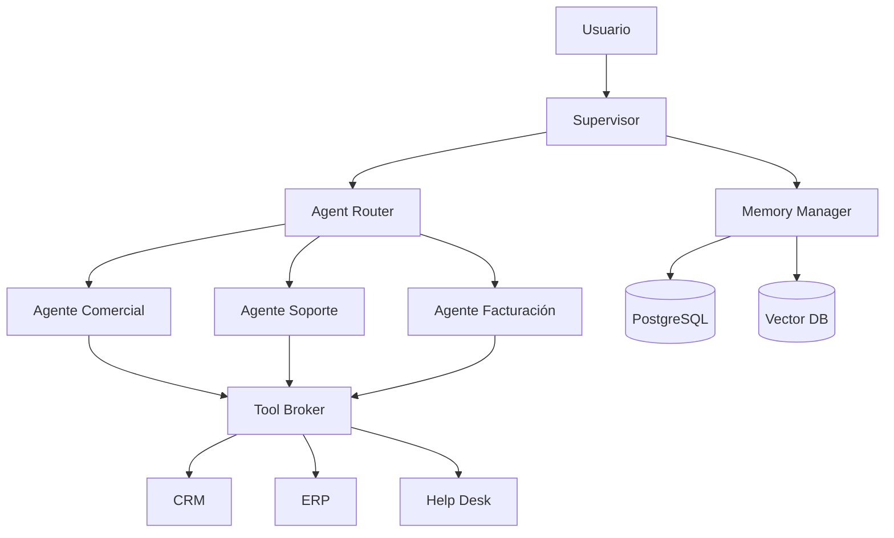
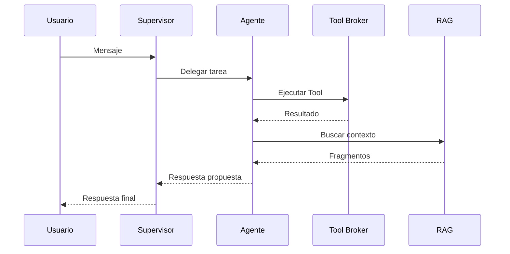

# Capítulo 6 — Arquitectura de Orquestación Multi‑Agente

**Construye sobre:** fase 4-multiagente / 01-Arquitectura_General

## Objetivo

Definir cómo colaboran los agentes de IA para resolver un radicado de forma coordinada, auditable y escalable.

---

# Principios

- Un único **Supervisor** toma decisiones de enrutamiento.
- Los agentes son especialistas.
- Ningún agente conoce implementaciones externas.
- Toda acción produce eventos.
- Todo intercambio conserva el contexto del radicado.

---

# Componentes

| Componente | Función |
|------------|---------|
| Supervisor | Clasifica y decide |
| Agent Router | Selecciona el agente |
| Specialized Agent | Ejecuta el trabajo |
| Memory Manager | Recupera contexto |
| Tool Broker | Ejecuta herramientas |
| Event Bus | Publica eventos |
| Human Handoff | Escala a humano |



# Ciclo de Orquestación

1. Llega un mensaje.
2. Se identifica el radicado.
3. Se recupera contexto.
4. El Supervisor clasifica intención.
5. El Router selecciona el agente.
6. El agente solicita herramientas si es necesario.
7. Se consulta RAG cuando aplica.
8. Se genera la respuesta.
9. Se registra auditoría y métricas.
10. Se responde al usuario.



# Handoff a Humano

Condiciones:

- Baja confianza.
- Solicitud explícita.
- Incumplimiento de política.
- Error repetitivo.
- Acción que requiere aprobación.

El radicado permanece abierto y conserva el historial.

# Contexto Compartido

Cada agente recibe únicamente:

- Resumen del radicado.
- Últimos mensajes relevantes.
- Datos del cliente.
- Resultado de herramientas.
- Fragmentos RAG.
- Objetivo de la tarea.

No recibe el historial completo para reducir costo de tokens.

# Contrato entre Agentes

```json
{
  "task":"resolver_ticket",
  "radicado_id":"UUID",
  "objetivo":"Responder incidencia",
  "contexto":"Resumen",
  "restricciones":["No inventar datos"],
  "toolkit":["consultar_ticket","buscar_documentacion"]
}
```

# Eventos

- TaskAssigned
- ToolRequested
- ToolCompleted
- AgentCompleted
- HumanEscalation
- RadicadoUpdated

# ADR

## ADR-012

El Supervisor nunca ejecuta herramientas; solo coordina.

## ADR-013

Los agentes solo intercambian tareas mediante contratos estructurados.

## ADR-014

El contexto compartido será resumido para minimizar consumo de tokens.

# Próximo capítulo

**Capítulo 7 — Arquitectura RAG y Gestión del Conocimiento**, donde se definirá la estrategia de indexación, chunking, embeddings, versionado y recuperación de contexto.
