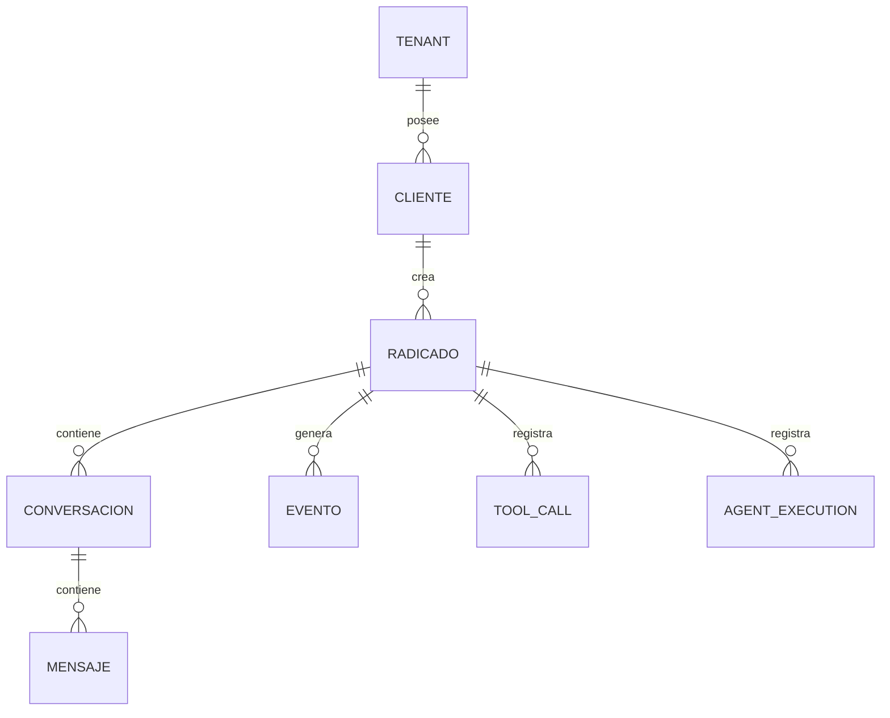

# Capítulo 8 — Modelo de Datos Empresarial

**Construye sobre:** fase 4-multiagente / 01-Arquitectura_General (multi-tenant)

## Objetivo

Definir el modelo de datos canónico de la plataforma.

## Principios
- Radicado como agregado raíz.
- Multi-tenant.
- Auditoría completa.
- Event Driven.

## ERD Conceptual

## Entidades
- tenant
- cliente
- contacto
- radicado
- conversacion
- mensaje
- evento
- tool_call
- agent_execution

## Índices
|Tabla|Índices|
|---|---|
|radicado|tenant_id, estado, area_id|
|mensaje|conversacion_id, created_at|
|evento|radicado_id, fecha|

## Multi-tenant
Todas las tablas de negocio incluyen tenant_id.

## Auditoría
created_at, updated_at, deleted_at, created_by, updated_by, version.

## ADR
- ADR-018: tenant obligatorio.
- ADR-019: soft delete.
- ADR-020: eventos inmutables.

## Próximo capítulo
Especificación de APIs.