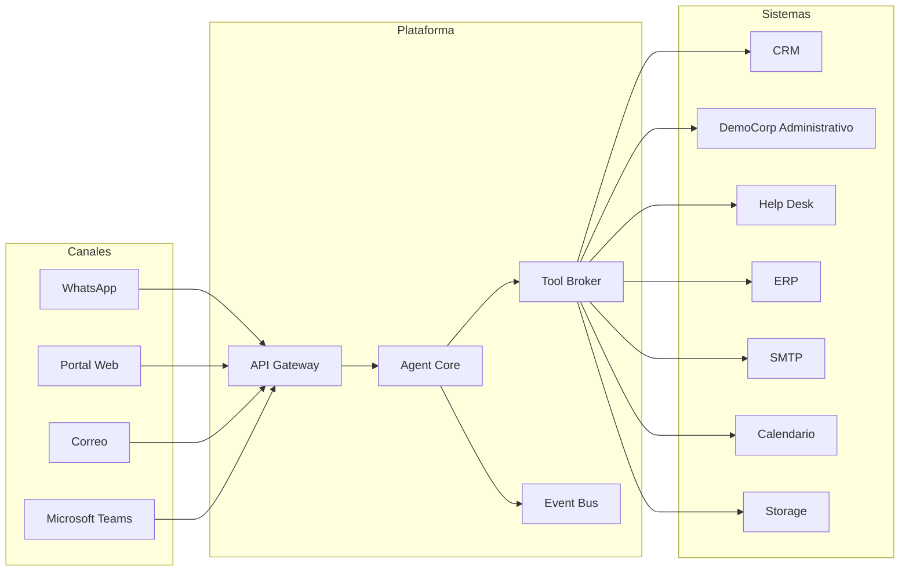

# Capítulo 10 — Arquitectura de Integraciones Empresariales

**Construye sobre:** fase 4-multiagente / 01-Arquitectura_General (Tool Broker)

**Versión:** 1.0

**Estado:** Draft

---

# 1. Objetivo

Definir la arquitectura de integración entre la plataforma de agentes inteligentes y los sistemas empresariales internos y externos.

La plataforma deberá integrarse con cualquier sistema sin modificar el dominio de negocio.

Todas las integraciones estarán desacopladas mediante **Ports & Adapters** y serán consumidas exclusivamente por el **Tool Broker**.

---

# 2. Principios

- Bajo acoplamiento
- Alta cohesión
- API First
- Event Driven
- Idempotencia
- Reintentos automáticos
- Observabilidad
- Auditoría
- Versionado

---

# 3. Arquitectura General



---

# 4. Filosofía

Los agentes nunca conocerán:

- URLs
- SQL
- APIs externas
- Credenciales

Siempre invocarán una **Tool**, y el Tool Broker decidirá qué adaptador utilizar.

```text
Agente
   │
ConsultarCliente()
   │
Tool Broker
   │
CRM Adapter
   │
CRM
```

---

# 5. Tipos de Integración

| Tipo | Ejemplo |
|------|----------|
| REST | CRM |
| SOAP | ERP legado |
| Base de Datos | DemoCorp Administrativo |
| Webhooks | Meta |
| Archivos | PDF, Excel, CSV |

---

# 6. Adaptadores

Cada sistema implementará un adaptador independiente.

- CRMAdapter
- DemoCorpAdapter
- HelpDeskAdapter
- ERPAdapter
- MetaAdapter
- SMTPAdapter
- CalendarAdapter
- StorageAdapter

Ningún adaptador podrá comunicarse directamente con otro.

---

# 7. Tool Broker

Responsabilidades:

- Validar parámetros
- Resolver permisos
- Ejecutar adaptadores
- Registrar auditoría
- Publicar eventos
- Gestionar reintentos
- Controlar timeouts

---

# 8. Integración con Meta

## Entrada

```http
POST /webhooks/meta
```

## Salida

Uso de la API oficial de WhatsApp Cloud para envío de mensajes.

Toda la complejidad de Meta permanecerá encapsulada en el `MetaAdapter`.

---

# 9. Integración con CRM

Operaciones principales:

- Consultar cliente
- Crear lead
- Consultar oportunidades
- Actualizar datos
- Registrar actividades

---

# 10. Integración con DemoCorp

## Primera fase

No se utilizará la API de DemoCorp.

Las integraciones serán con:

- CRM
- Plataforma de soporte
- Módulos administrativos
- Base de datos autorizada (si aplica)

## Segunda fase

Integración mediante la API oficial de DemoCorp.

---

# 11. Plataforma de Soporte

Operaciones:

- Consultar ticket
- Crear ticket
- Actualizar ticket
- Cerrar ticket
- Consultar SLA
- Agregar comentarios

---

# 12. ERP

Consultas permitidas:

- Facturas
- Cartera
- Inventario
- Pedidos
- Pagos

Las operaciones de escritura deberán requerir autorización explícita.

---

# 13. Correo Electrónico

Soporte para:

- SMTP
- Microsoft Graph
- Gmail

Casos de uso:

- Confirmaciones
- Escalamientos
- Resúmenes
- Notificaciones

---

# 14. Calendarios

Operaciones:

- Consultar disponibilidad
- Crear reunión
- Modificar reunión
- Cancelar reunión

---

# 15. Almacenamiento

Compatibilidad con:

- Amazon S3
- Azure Blob Storage
- MinIO

Operaciones:

- Subir
- Descargar
- Versionar
- Eliminar

---

# 16. Reintentos

Backoff exponencial recomendado:

```text
1 s
↓
2 s
↓
5 s
↓
10 s
↓
Error
```

---

# 17. Circuit Breaker

Estados:

- Closed
- Open
- Half Open

Protege a la plataforma frente a fallos repetitivos en sistemas externos.

---

# 18. Timeouts

| Sistema | Timeout |
|---------|---------|
| Meta | 5 s |
| CRM | 5 s |
| SMTP | 10 s |
| ERP | 15 s |

---

# 19. Observabilidad

Registrar:

- Sistema
- Operación
- Duración
- Resultado
- Error
- Radicado
- Usuario
- Trace ID

---

# 20. Seguridad

- Secret Manager
- API Keys rotativas
- OAuth2 cuando aplique
- TLS en todas las comunicaciones
- Nunca almacenar credenciales en el código

---

# 21. Eventos

- ClienteConsultado
- TicketCreado
- TicketActualizado
- FacturaConsultada
- MensajeWhatsAppRecibido
- MensajeWhatsAppEnviado

---

# 22. Interfaces

```python
from typing import Protocol

class CRMPort(Protocol):

    async def obtener_cliente(self, cliente_id: str):
        ...

    async def crear_lead(self, datos: dict):
        ...

    async def actualizar_cliente(self, cliente_id: str, datos: dict):
        ...
```

---

# 23. ADR

## ADR-024

Toda integración deberá implementarse mediante un Adapter.

## ADR-025

Los agentes nunca consumirán APIs directamente.

## ADR-026

El Tool Broker será el único componente autorizado para ejecutar herramientas externas.

## ADR-027

Las credenciales deberán almacenarse en un gestor seguro de secretos.

---

# Próximo Capítulo

**Capítulo 11 — Arquitectura de Memoria y Gestión del Contexto**, donde se definirá la memoria de corto y largo plazo, resúmenes, recuperación de contexto y continuidad entre conversaciones.
