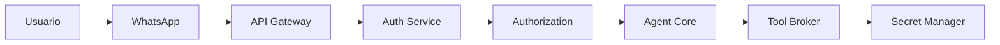

# Capítulo 13 — Seguridad, Autenticación y Gobierno

**Construye sobre:** fase 4-multiagente / 03-Modelo_Datos_Empresarial (multi-tenant, RBAC/ABAC)

**Versión:** 1.0

**Estado:** Draft

---

# 1. Objetivo

Definir la estrategia de seguridad de la plataforma para proteger la información, garantizar el aislamiento entre empresas (multi-tenant), controlar el acceso a los recursos y establecer políticas de gobierno para agentes, usuarios e integraciones.

---

# 2. Principios

- Zero Trust
- Security by Design
- Least Privilege
- Defense in Depth
- Multi-Tenant Security
- Auditoría Total
- Secret Management
- Cumplimiento Normativo

---

# 3. Arquitectura de Seguridad

---

# 4. Autenticación

## Usuarios

- OAuth2
- OpenID Connect
- JWT

## Integraciones

- API Keys
- OAuth2 Client Credentials
- Mutual TLS (opcional)

## Servicios Internos

- JWT firmado
- mTLS (futuro)

---

# 5. Autorización

Modelo principal:

## RBAC

Roles sugeridos:

| Rol | Permisos |
|------|----------|
| Administrador | Acceso total |
| Supervisor | Gestión de radicados |
| Agente | Atención de casos |
| Analista | Consulta |
| Auditor | Solo lectura |

---

## ABAC (Fase 2)

Restricciones por:

- Tenant
- Área
- Horario
- Ubicación
- Tipo de dato

---

# 6. Seguridad Multi-Tenant

Cada petición deberá incluir:

- tenant_id
- usuario
- roles
- permisos

Ningún tenant podrá acceder a información de otro.

---

# 7. Gestión de Secretos

Las credenciales nunca se almacenarán:

- En el código
- En archivos .env compartidos
- En repositorios Git

Opciones recomendadas:

- HashiCorp Vault
- Azure Key Vault
- AWS Secrets Manager

---

# 8. Seguridad del Agent Core

Los agentes:

- No conocen credenciales.
- No acceden directamente a APIs.
- Solo utilizan Tools autorizadas.
- Todas las Tool Calls son auditadas.

---

# 9. Seguridad del RAG

Validaciones:

- Colección autorizada.
- Tenant correcto.
- Clasificación del documento.
- Nivel de acceso.

Nunca mezclar documentos entre empresas.

---

# 10. Protección contra Ataques de IA

Mitigaciones:

- Prompt Injection
- Jailbreak
- Tool Poisoning
- Data Exfiltration
- Prompt Leakage

Estrategias:

- Validación de entrada.
- Sanitización.
- Lista blanca de herramientas.
- Políticas de ejecución.

---

# 11. Protección de APIs

Aplicar:

- TLS 1.3
- Rate Limiting
- CORS
- CSRF (cuando aplique)
- Validación de esquemas
- Límite de tamaño de payload

---

# 12. Gestión de Sesiones

- JWT de corta duración.
- Refresh Tokens.
- Revocación de sesiones.
- Logout centralizado.

---

# 13. Auditoría de Seguridad

Registrar:

- Inicio de sesión
- Fallos de autenticación
- Cambios de permisos
- Acceso a herramientas
- Cambios administrativos
- Uso de API Keys

---

# 14. Cumplimiento

Diseñar considerando:

- ISO 27001
- SOC 2
- GDPR
- Habeas Data (Colombia)

---

# 15. Gobierno

Definir políticas para:

- Versionado de APIs
- Gestión de prompts
- Publicación de herramientas
- Ciclo de vida de agentes
- Gestión documental

---

# 16. ADR

## ADR-035

Todo acceso deberá autenticarse antes de llegar al Agent Core.

## ADR-036

Los agentes nunca tendrán acceso directo a credenciales.

## ADR-037

Las Tools aplicarán autorización antes de ejecutar acciones.

## ADR-038

Toda acción administrativa será auditada.

---

# 17. Roadmap

## MVP

- JWT
- RBAC
- API Keys
- Auditoría

## Fase 2

- ABAC
- Vault
- mTLS
- Gestión centralizada de secretos

## Fase 3

- Zero Trust completo
- Detección de anomalías
- Políticas adaptativas

---

# Próximo Capítulo

**Capítulo 14 — Arquitectura de Despliegue y DevOps**, donde se definirá Docker, Kubernetes, CI/CD, escalabilidad, alta disponibilidad, recuperación ante desastres y operación en producción.
