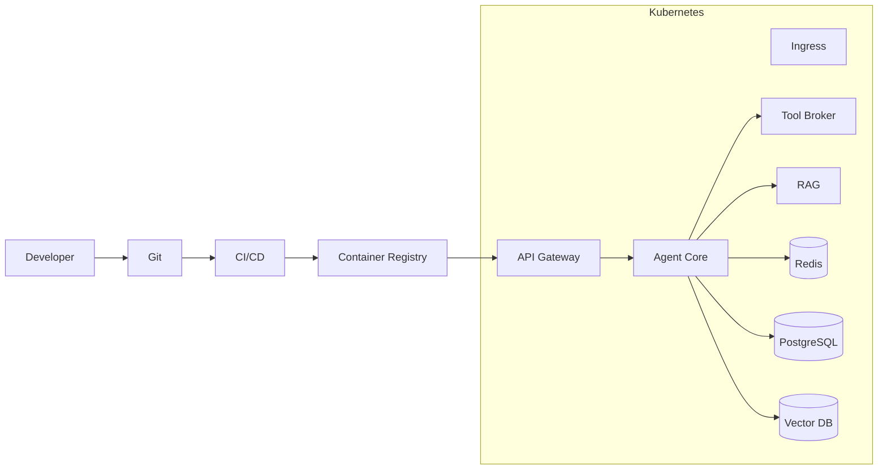

# Capítulo 14 — Arquitectura de Despliegue y DevOps

**Construye sobre:** fase 4-multiagente / 05-Seguridad_Autenticacion_Gobierno (despliegue Kubernetes vs docker-compose de fase 2)

**Versión:** 1.0  
**Estado:** Draft

---

# 1. Objetivo

Definir la arquitectura de despliegue de la plataforma de agentes empresariales, incluyendo ambientes, contenedorización, CI/CD, alta disponibilidad, observabilidad, recuperación ante desastres y operación en producción.

---

# 2. Principios

- Infrastructure as Code
- Immutable Infrastructure
- GitOps Ready
- Alta Disponibilidad
- Escalabilidad Horizontal
- Seguridad por Defecto
- Observabilidad Integrada
- Automatización del Ciclo de Vida

---

# 3. Ambientes

| Ambiente | Propósito |
|-----------|-----------|
| Local | Desarrollo |
| Dev | Integración |
| QA | Validación |
| Staging | Preproducción |
| Producción | Operación |

---

# 4. Arquitectura General

---

# 5. Contenedores

Cada componente se desplegará como un contenedor independiente.

- API Gateway
- Agent Core
- Tool Broker
- Memory Manager
- RAG Service
- Worker
- Scheduler
- Frontend

---

# 6. Docker

Cada servicio incluirá:

- Dockerfile multi-stage
- Usuario no privilegiado
- Healthcheck
- Variables por entorno

---

# 7. Kubernetes

Recursos recomendados:

- Deployment
- Service
- Ingress
- ConfigMap
- Secret
- HorizontalPodAutoscaler
- NetworkPolicy
- PodDisruptionBudget

---

# 8. Escalabilidad

Escalar horizontalmente:

- API Gateway
- Agent Core
- Tool Broker
- Workers

Escalar verticalmente:

- PostgreSQL
- Vector DB

---

# 9. Balanceo

El tráfico ingresará mediante un Ingress Controller y será distribuido entre múltiples réplicas.

---

# 10. CI/CD

Pipeline sugerido:

1. Commit
2. Build
3. Tests
4. Análisis estático
5. Imagen Docker
6. Publicación
7. Despliegue
8. Smoke Tests

---

# 11. Estrategias de Despliegue

- Rolling Update
- Blue/Green
- Canary

---

# 12. Configuración

Separar:

- Código
- Configuración
- Secretos

Nunca almacenar secretos en el repositorio.

---

# 13. Backups

Respaldar:

- PostgreSQL
- Vector DB
- Configuración
- Documentos

Periodicidad:

- Diario
- Semanal
- Mensual

---

# 14. Recuperación ante Desastres

Objetivos:

- RPO < 15 minutos
- RTO < 60 minutos

Procedimientos documentados y probados.

---

# 15. Observabilidad

Integrar:

- OpenTelemetry
- Prometheus
- Grafana
- Loki
- Jaeger

---

# 16. Seguridad Operacional

- Escaneo de imágenes
- Firma de artefactos
- Políticas de admisión
- Rotación de secretos
- TLS extremo a extremo

---

# 17. Infraestructura como Código

Herramientas sugeridas:

- Terraform
- Helm
- Ansible (opcional)

Toda infraestructura deberá ser reproducible.

---

# 18. Topologías

## Pequeña

- 1 nodo Kubernetes
- PostgreSQL
- Redis

## Mediana

- 3 nodos
- Balanceador
- Réplica PostgreSQL

## Enterprise

- Múltiples zonas
- Alta disponibilidad
- Autoescalado
- Disaster Recovery

---

# 19. ADR

## ADR-039

Todos los servicios serán desplegados en contenedores.

## ADR-040

Kubernetes será la plataforma objetivo para producción.

## ADR-041

La infraestructura se administrará mediante IaC.

## ADR-042

Toda liberación pasará por un pipeline CI/CD automatizado.

---

# 20. Roadmap

### MVP

- Docker Compose
- CI básico
- Backups
- Monitoreo

### Fase 2

- Kubernetes
- HPA
- GitOps
- Blue/Green

### Fase 3

- Multi-Región
- Auto Recovery
- FinOps
- Chaos Engineering

---

# Próximo Capítulo

**Capítulo 15 — Roadmap Tecnológico y Evolución de la Plataforma**, donde se definirá la evolución funcional y técnica del producto para los próximos años.
